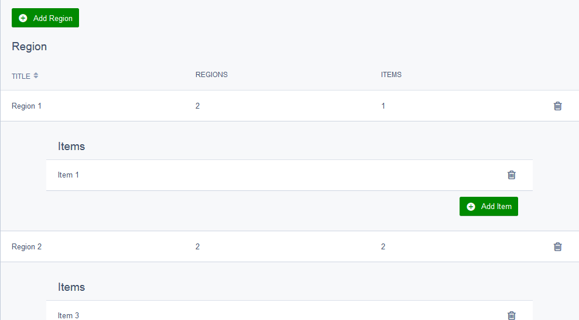

# Silverstripe-Sectioned-Grid-Field

## Usage ##
Sectioned GridField extends the GridField class, albiet with added functionality to allow components to modify//expand grid rows. Configuration is more or less the same between the two.
```php
$fields->addFieldToTab('Root.Regions', SectionedGridField::create(
 'Regions',
 'Region',
 $this->Regions(),
 new GridFieldConfig_ManyEditor('Items')
));
```
## GridFieldConfig_ManyEditor ##
`GridFieldConfig_ManyEditor` is a GridFieldConfig that implements the `GridFieldSubGrid` component and takes a `$has_many` or `many_many` to parse into a child GridField. It can optionally be passed a GridFieldConfig that will be used to parse the child GridField like so: `new GridFieldConfig_ManyEditor('Items', new GridFieldConfig_RecordEditor()`. If no GridFieldConfig is specified, `GridFieldConfig_Min` will be used by default.



## GridFieldSubGrid ##
`GridFieldSubGrid` is a component that opens up a grid's childfield and spreads it out into it's own contained gridfield. It can be added to prebuilt GridFieldConfigs such as `GridFieldConfig_Base` and `GridFieldConfig_RecordEditor` or used to create a new GridFieldConfig.
```php
$config->addComponent(new GridFieldSubGrid('Field to Expand'[, GridFieldConfig]));
```
`GridFieldSubGrid` takes the name of a field item to expand, and optionally a GridFieldConfig to expand that field item into. If no GridFieldConfig is specified, `GridFieldConfig_Min` will be used by default.

## GridFieldConfig_Min ##
Is a mini GridFieldConfig designed to work well with `GridFieldSubGrid`. Alternate GridFieldConfigs can be used in it's place, but they may not be formatted as well.

## Limitations ##
Currently, `GridFieldSubGrid` doesn't play nice with sorting and filter components such as `GridFieldSortableHeader`. Those components are still accessible and still work with `GridFieldSubGrid`, in fact `GridFieldConfig_Min` and `GridFieldConfig_ManyEditor` use them, but their sort and filter functions have been disabled. I may fix them later on if I can figure out a way to implement them.
